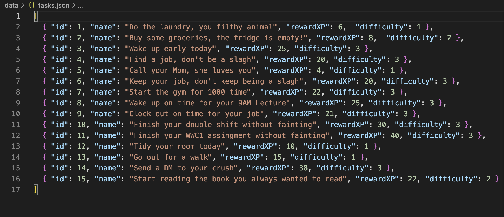
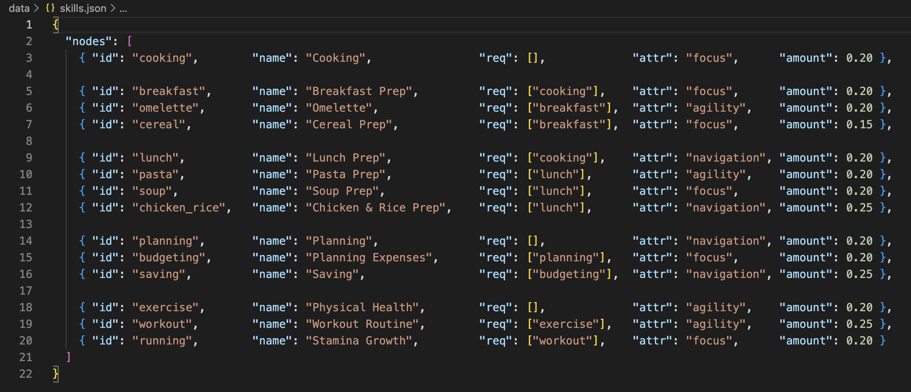

# :memo: [To_Do_List_RPG]
*_"He'd wanted to get stronger every time he'd experienced a crisis. He'd wanted to escape the unstable lifestyle that made him feel like he was constantly hanging on the edge of a cliff [...] **The System will use me, and I will use the System.**"_* _- [Solo Leveling. Chugong. 2016, pp.176.]_

## [About]
*Every day errands, tasks or reminders become side quests to develop and evolve a virtual agent. When the user complete one of these side quests the agent grows bigger, faster and stronger capable to fullfil more complex tasks. Every time the agent *levels-up* the user can unlock one skill [every day skills, like cooking an omelette or wash clothes] that helps the agent to evolve and be more productive with its "life".*

## [Abstract]
*I generally struggle with setting tasks and goals and then following through on them. This doesn't mean I lack effort: I work every day to be productive and to pursue what I set out to do. Rather, it means that I tend to procrastinate when it comes to systematizing my goals into an orderly, continuous process of personal development and growth. To bridge that gap, I connected this frustration to an RPG-style gamification structure. Instead of treating tasks as isolated obligations, I reframed them as “every-day side quests” that generate visible rewards—experience points, level-ups, and unlockable skills—so that progress becomes concrete and motivating.*

*With this idea clear in my mind, I decided to draw on Daniel Shiffman’s explanation of genetic algorithms in *The Nature of Code* and treat my virtual agent as a kind of “living organism” simulation: it solves small problems and evolves based on the user’s interaction. In this context, completed tasks work like a fitness signal, repetition produces measurable progress, and the user’s decisions function like selection, shaping which skills and attributes get reinforced over time [Shiffman, 2012]. This is where the gamification layer becomes essential: by translating routines into visible feedback loops (XP, levels, unlocks), the system makes progress feel personal.*

## [General Rules]
*In a more concrete technical terms, the project is built around three core systems that I designed to work together and fully support this interactive experience: **the world**, **the task manager** and **the agent's status**.*

1. The user does not control *the agent's* actions in the world.
2. *The agent* has three base stats that can be improved as it levels-up:
   - [Agility] = speed to move in the world.
   - [Navigation] = obstacles avoiding capacity.
   - [Focus] =  detection of the goal.
3. The task manager defines all the side quests *the agent* will attempt to complete.
4. Each side quests has a difficulty level: **[D1]** three obstacles, **[D2]** six obstacles, **[D3]** eight obstacles in the world.
5. *The agent* will earn a specific amount of experience points **[XP]** for each side quest completed.
6. Every time *the agent* levels-up it will gain a new *every day skill*.
7. The skills represent an every day hability neccesary for being more productive: cooking, planning, budgeting, work out, etc.
8. When the user unlocks an skill, one of *the agent's* main stats may rose, making it more efficient at completing the following tasks. [e.g. cooking + 0.20 in Focus stat].
9. The user cannot access *the agent's* skill network unless it levels-up.
10. More than a player, the user acts as a taskmaster, choosing which side quest the agent should complete, monitoring its performance, and guiding its growth and improvement.

## [JSON files specifications]
*The side quest and skill data are stored in two JSON files: **tasks.json** and **skills.json**, respectively. Anyone familiar with this file format can experiment with them to suit their needs. You can add or remove side quests, adjust their difficulty, and change how much experience they grant. Likewise, the skill network can be expanded by adding new skills that fit the preferences and goals of whoever is runing this project.*

## [How to Run]
1. Download the repo and save it on your machine.
2. Run it using any IDE of your choice [ideally *VS Code*, thanks to it's feature of *Live Server* is possible to run JavaScript code on browser easily].

## [Requirements]
- The project itself can easily run on any machine that has the necessary files downloaded.
- It can be executed on any IDE that supports JavaScript technology [ideally *VS Code*].
- Internet Browser.

## [Setup]
*The exhibition of this first edition of the project only required a laptop connected to a projector, which showcased how the entire experience worked.*

## [Media]
*The project was presented during a *pin-up* session at the Church at Goldsmiths, University of London:*

https://github.com/user-attachments/assets/b69ccc03-89d8-495f-aa9f-a38025d5c274

## [Technology]
*Project made with p5.js, DOM manipulation with HTML and CSS, and data handling through JSON files.*
*No other libraries were used.*

## [Acknowledgements]
- Chou, Yu-kai. Actionable Gamification: Beyond Points, Badges, and Leaderboards. North Charleston, SC: CreateSpace Independent Publishing Platform, 2015.
- Chugong. Solo Leveling. Vol. 1. Papyrus, 2016.
- Shiffman, Daniel. “Chapter 9: Evolutionary Computing.” The Nature of Code. 2012. Accessed January 12, 2026. https://natureofcode.com/genetic-algorithms/.
- Shiffman, Daniel. “Coding Challenge #29: Smart Rockets in p5.js.” YouTube video. August 2, 2016. https://www.youtube.com/watch?v=bGz7mv2vD6g.
- Shiffman, Daniel. “Example 9.3: Smarter Rockets.” p5.js Web Editor. Accessed January 12, 2026. https://editor.p5js.org/natureofcode/sketches/565K_KXSA.

## [License]
*No specific license is required.*

## [Contact]
- **GitHub Repo:** https://github.com/A-serna0415/wcc2-workshop-1.git
- **Demo link:** https://youtu.be/KuRvhi2i-JY
